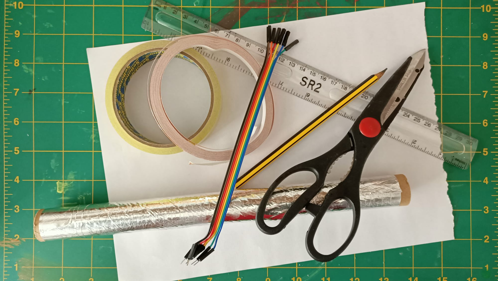
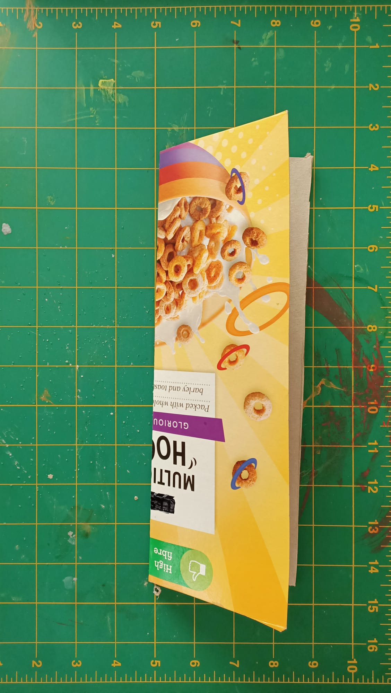
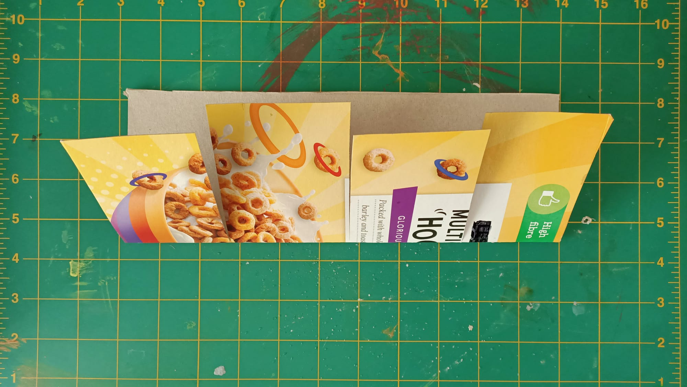
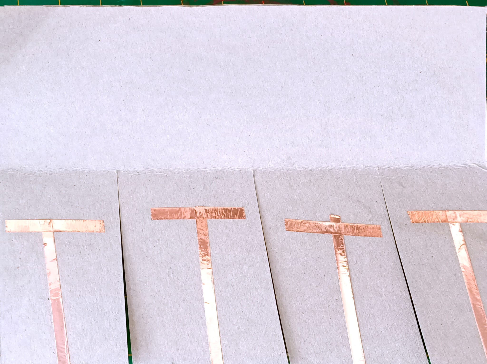
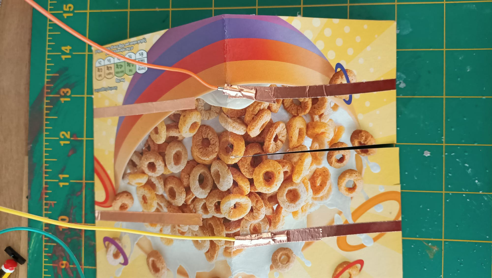
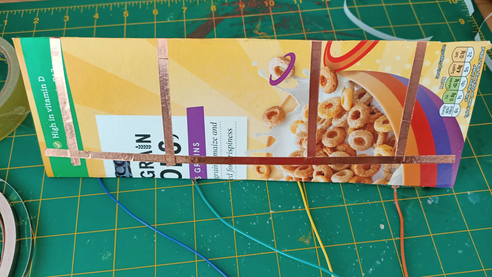
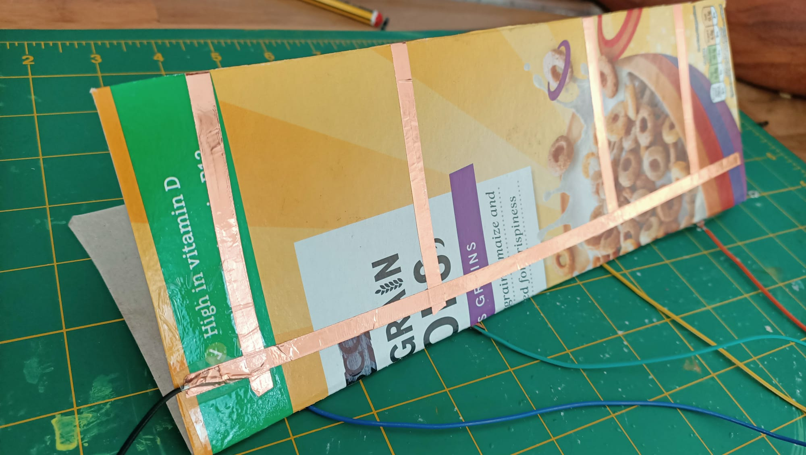
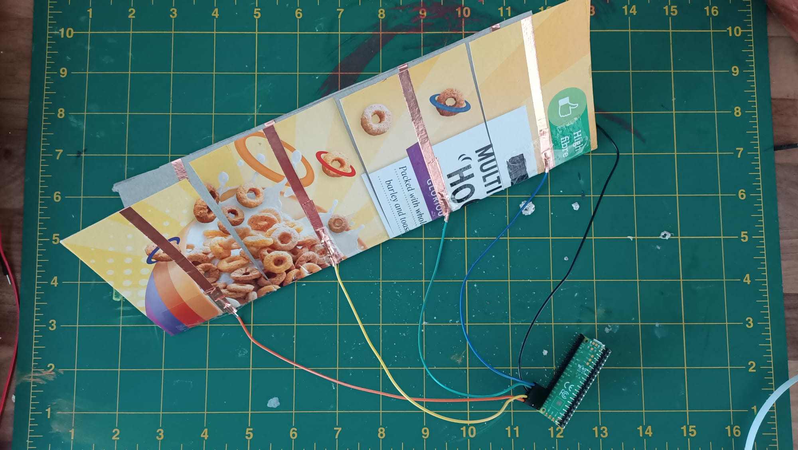

To create a cardboard push switch you will need:

+ Thin card or thick paper
+ A pair of scissors
+ Aluminium foil or conductive tape
+ A glue stick
+ Sticky tape
+ Pin - Socket jumper wires (2 for each switch)

**Optional:**
+ A pencil and ruler (if you want to be more precise with your make)

**Instructions:**

**Step 1:** Take your piece of card and fold it in half lengthways.

**Step 2:** Make snips with your scissors in one side of the folded card, cutting only up to the fold line. These will be our different buttons. In the example here, we are making four buttons.

**Step 3:** Fold the 'buttons' over. Take your aluminium foil and glue stick (or conductive tape) and stick a strip to the upward facing side on each of the folded 'buttons'. Making sure that you start at the fold and run the strip up and over the top edge of the button, then down the other side:

Repeat for each button you have cut.

**Step 4:** Fold the buttons out flat. Add a cross piece of foil or tape to the inside of each button so it makes a 'T' shape. This will make sure we get a good contact when we press the button.

**Step 5:** With the buttons still folded flat, stick another piece of foil or tape for each button to the back half of your card. Start at the fold and go up and over the edge of the card, and down the back. Make sure that the two pieces of conductive material **do not touch one another** at the fold on the back, or you will create a *short circuit* and the button will think it's always pressed. 

**Step 6:** Turn the card over so the folded side is down. Take your socket-pin jumper wires and poke the pin end through the end of the foil or tape on the front of the buttons, securing it with more conductive tape or some sticky tape.

**Step 7:** Take another piece of conductive material and stick it down lengthways across the card, making sure you touch all the other pieces of conductive material on the back. This will allow you to use a single ground pin for your button array. Take another socket-pin jumper wire and poke the pin end through the end of the foil or tape just added, securing it with more conductive tape or some sticky tape.

**Step 8:** Connect the socket ends of your jumper wires to the pins on your device - this should be one numbered pin for each button and a single ground pin for the jumper wire on the end. (Here you can see the buttons connected to pins 16, 17, 18 and 19 on a Raspberry pi Pico, ready to be used.)

